#Saral Bhagat- CS565 - Fall 2019
#Assignments

## Assignment 0 - Setup

I signed up for our Slack channel, verified installation of GIT, read the syllabus, and downloaded and installed VS Code.

## Assignment 1 - HTML

**Exercise 1** - Created a repo for assignments, HTML form.

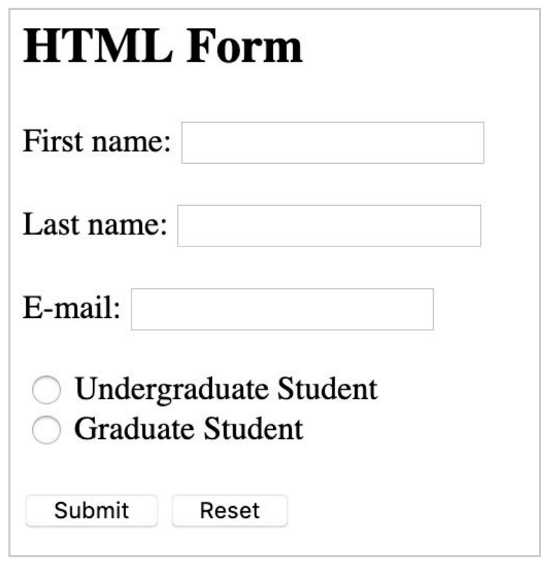

**Exercise 2** - Recreated HTML elements from [wikipedia.org/](http://wikipedia.org/).

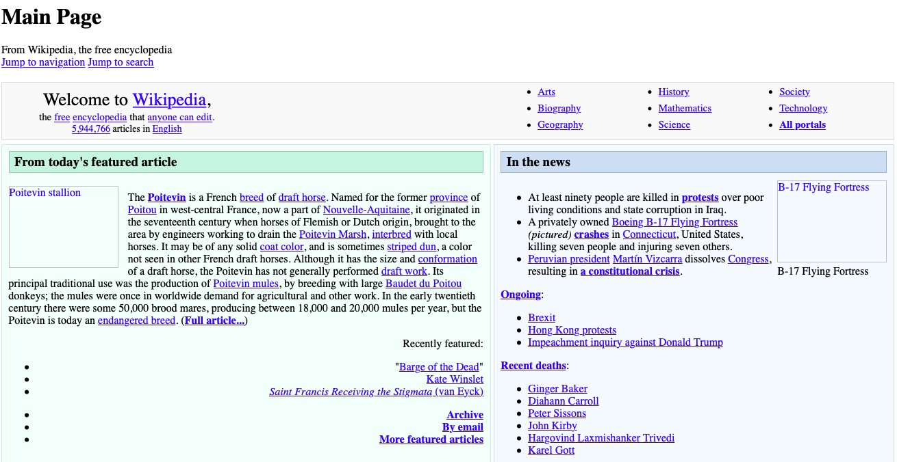

**Exercise 3** - Made the HTML elements of a portfolio website. It included my name, a brief bio, a header, a footer, a section, an unordered list, three different types of headers, three photo elements, and a contact form.

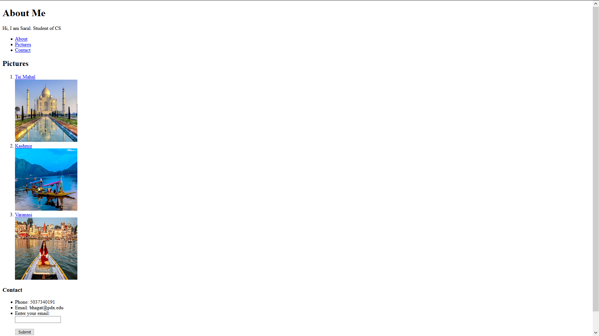

## Assignment 2 - CSS

**Exercise 1** - Copied previous assignment’s exercise 1 and styled it using CSS as per instructions.

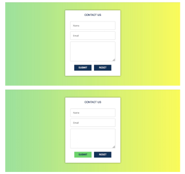

**Exercise 2** - Copied previous assignment’s exercise 2 and styled the HTML elements to mirror [http://wikipedia.org/](http://wikipedia.org/).

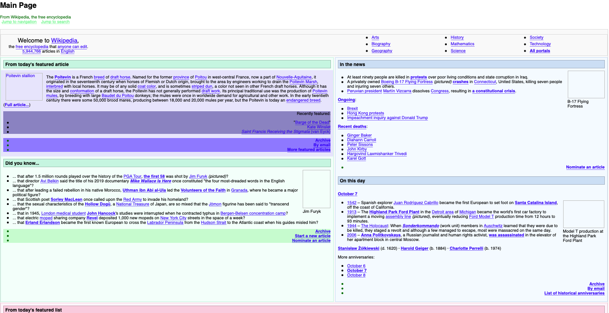

## Assignment 3 - CSS Layout and Bootstrap

**Exercise 1** - Styled the contact form below using Boostrap elements.

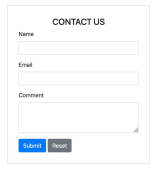

**Exercise 2** - Recreated the color grid below using Boostrap.

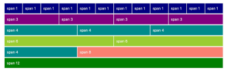

**Exercise 3** - Implemented Bootstrap Grid to recreate the layout below.

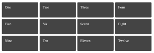

**Exercise 4** - Implemented CSS Flexbox for the layout below.

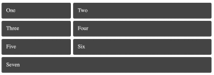

**Exercise 5** - Implemented CSS Grid for the layout below.

**Exercise 6** - Implemented CSS Grid for the layout below.

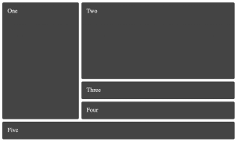

**Exercise 7** - Implemented CSS Grid for the layout below.

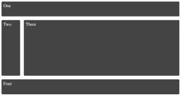

**Exercise 8** - Implemented CSS Grid for the layout below.

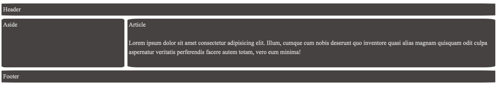

compact version using Media Queries
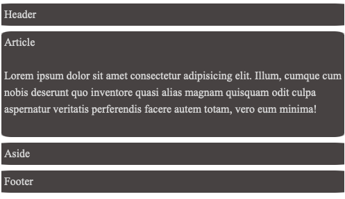

## Assignment 4 - Javascript

**Exercise 1** - Wrote a FizzBuzz program to the the console.

**Exercise 2** - Wrote a function that reverses the digits in a number that prints to the console.

**Exercise 3** - Copied A3Ex1 Contact Form and added the functionality of printing the form results to the console.

**Exercise 4** - Created a webpage using Javascript that outputs the current width and height of the browser window. It dynamically changes when the window size changes.

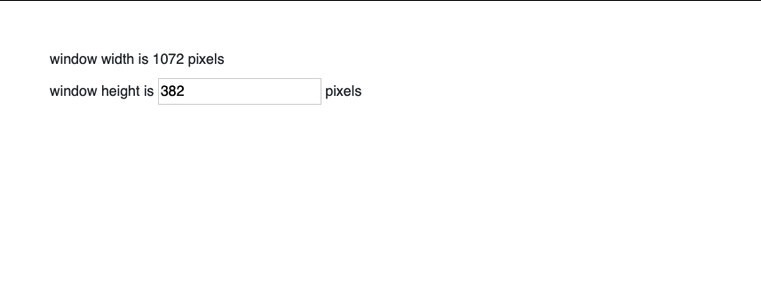

**Exercise 5** - Used Javascript and HTML to  output a random background color and the color's hexadecimal value to a page each time the user clicks the button.

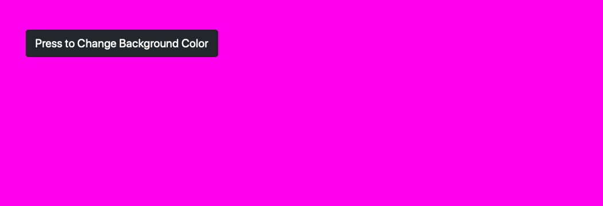

## Assignment 5 - Express

Created an Express server and middleware to handle the input and output of a form. The "submit" page prints out the information entered into the form.

## Assignment 6 - Node, Express, React, Angular, TypeScript, Vue

Completed the following tutorials (with the resulting code in the assignment 6 folder):

1. [React Tutorial](https://reactjs.org/tutorial/tutorial.html)

2. [Typescript Tutorial](https://angular-presentation.firebaseapp.com/angular/typescript/intro)

3. [Angular Tutorial](https://codelab.fun/angular/create-first-app/intro)
